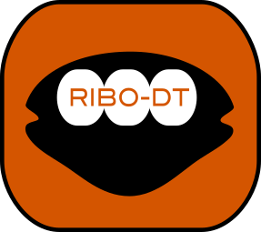

# Ribo-DT 

**Ribo-DT** is a snakemake pipeline to infer single-codon and codon-pair dwell times as well as gene flux from ribosome profiling data using generalized linear model (GLM) with negative binomial noise (Gobet et al., PNAS, 2020).

**Ribo-DT** consists of a `Snakefile`, a [`conda`](https://conda.io/docs/) environment file (`Ribo_DT.yaml`), a configuration file (`config.yaml`) and a set of `R` and `perl` scripts to infer ribosome dwell times and gene flux from raw ribosome profiling data.


## Ribo-DT pipeline overview

1. Download the genome, cds and gtf files from [`ENSEMBL`](https://www.ensembl.org/index.html) according to the species defined in the configuration file (`config.yaml`).  
2. Build genome index using [`STAR`](https://github.com/alexdobin/STAR).
3. Download SRA run files (SRR token) specified in the sample spreadsheet from GEO database.
4. Convert SRA to FASTQ files.
5. Merge FASTQ files run from the sample according to the the sample spreadsheet definition.
6. STAR alignment to genome with inline adapter clipping (defined in the configuration file).
7. Bam files indexing.
8. Read counts and cds positions are retrieved.
9. Parse the downloaded cds file to be used as a reference in the GLM fit.
10. Load the parsed and read count files to generate the matrix for the fit.
11. Gene and position filtering. Fit the generalized linear model with the `glm4` function.
12. Compute coefficients p-value and rescale the coefficients according to our convention (see method section in the paper).
13. Plot single and codon-pair dwell time heatmaps as well as fragment size distribution.

Note that when RNA-seq and Ribo-seq are provided for the same sample, RNA-Seq is fitted first and used as an GLM offset in the Ribo-seq fit to reduce library preparation bias. 

## Running the Ribo-DT pipeline

**Prerequisites**  
The current workflow is designed to run on high computing cluster with [`slurm`](https://slurm.schedmd.com/) workload manager but `running_command.sh` can be modified to match your cluster configuration. All the required packages and softwares are installed via the [`conda`](https://conda.io/docs/) environment file (`Ribo_DT.yaml`).

**Clone the github repository and change directory**  
Clone this git repository to the location where you want to run your analysis 
```
git clone https://github.com/cgob/codonDT_snakemake.git
cd codonDT_snakemake
```
**Download and install conda (select an appropriate version for your operating system)**
```
wget https://repo.anaconda.com/miniconda/Miniconda3-latest-Linux-x86_64.sh
bash Miniconda3-latest-Linux-x86_64.sh
```
Restart your terminal

**Activate conda environment**  
This step install snakemake, all the required softwares, librairies, and dependencies in a [`conda`](https://conda.io/docs/) environment to run the workflow.
```
conda env create -f Ribo_DT.yaml
conda activate Ribo_DT
```
**Sample file**  
Edit the sample file (`samples.tsv` or your own file).  
1. A minimal header with the fields "SAMPLES", "Type" and "SRR" is required.  
2. Fill the sample names, type (**RIBO** for ribosome profiling dataset or **RNA** for rna-seq dataset) and GEO run accession number. To do so, extract the [`GEO`](https://www.ncbi.nlm.nih.gov/geo/) accession number of the study of interest. Click on run selector, select your samples of interest and download the metadata text file. This file can be edited to meet the sample file requirements.
3. In case fastq files are directly provided, files names must be specified under the "SRR" field without the ".fastq" extension and placed in the "/workdir/data/raw/" output folder.

**Configuration file**  
Edit the configuration file (`config.yaml`). Set: 
1. `workdir` with the path of the output and working files.  
2. `homedir` with the path of the Snakefile directory.  
3. `species` with the proper species for your dataset (Mouse, Human, Yeast).  
4. `adapter` with the 3'-adapter used during library preparation of your dataset.
5. `L1` with the read size lower bound ( `L1` > reads > `L2` are kept for the fit).  
6. `L2` with the read size upper bound.  
7. `library` with 'pos_neg' or 'neg_pos' depending on the strandness configuration of your library preparation.  
8. `samples` with the tab-delimited file defined above describing your samples.
9. `filter_1` with filter threshold for the minimum number of reads per gene.
10. `filter_2` with p-value threshold for dwell times in the heatmap representation.
11. `pos_A` with the position (in codon) of the A site relative to 5-end of the read.


**Running the pipeline**
```
bash running_command.sh
```
## Author
Cédric Gobet
